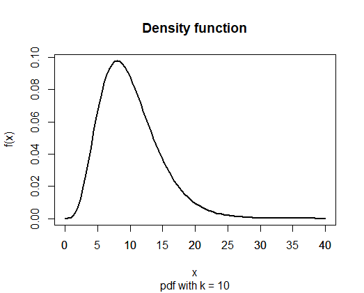
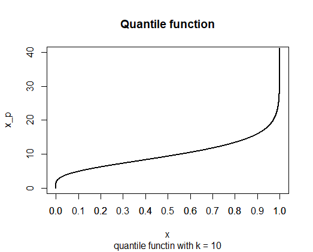

---
output:
  pdf_document: default
  html_document: default
---

***

## $\chi^2$ distribution

Notation:

$$ X \sim \chi^2_k \quad\text{with}\quad k \in \mathbb{R}^{>0} $$

The $\chi^2$ distribution is a continuous distribution with $k$ *degrees of freedom*. 
Expected value and variance are given by:

$$ \text{E}(X) = k \qquad\text{and}\qquad \text{Var}(X) = 2k $$

### Density function

The density function is given by:

$$ f(x) = \begin{cases}
\frac{x^{\frac{k}{2} - 1} \exp{-\frac{x}{2}}}{2^{\frac{k}{2}}\Gamma\left(\frac{k}{2}\right)} & \text{for}\quad x > 0 \\\\
0 & \text{otherwise}
\end{cases} $$

where $\Gamma(x) = \int^{+\infty}_0 t^{x-1}e^{-t} dt$ is the gamma function for $x$.

We can motivate the $\chi^2$ distribution via the standard normal distribution:
a sum of stochastically independant, quadratic standard normally distributed random variables follows a $\chi^2$ distribution with $k$ degrees of freedom where $k$ is the number of terms of the sum. Therefore, we have:

$$ \sum^k_{i = 1} z^2_i \sim \chi^2_k \quad\text{with}\quad z_i \sim N(0,1)\quad\text{and}\quad\text{Cov}(z_i,z_j) = 0 \quad\forall i\neq j $$

### Cumulative distribution function

The cumulative distribution function (cdf) is given by:

$$ F(x) = P(X \leq x) = \int^{x}_{-\infty}f(t) dt $$

The value of the cumulative distribution function is the probability that the random variable $X$ is less than or equal to $x$.

### Quantile function

The quantile function returns the value $x_p$ under which is $p$%  of the probability mass.
Formally, the quantile function is the inverse of the distribution function:

$$ x_p = F^{-1}(p) = F^{-1}[P(X \leq x_p)] $$
 \
 \

---

### Excel commands

#### Density function and distribution function of the $\chi^2$ distribution

+ `=CHIQU.VERT`($x$; $k$; **kumuliert**)

    + $x$ := The value $x$ the function should be evaulated at
    + $k$ := Degrees of freedom
    + kumuliert = 1 := Value of the distribution function (a probability)
    + kumuliert = 0 := Value of the density function (not a probability!)

#### Right-tail of the $\chi^2$ distribution

+ `=CHIQU.VERT.RE`($x$; $k$)

    + $x$ := The value $x$ the function should be evaulated at
    + $k$ := Number of degrees of freedom
        
The function `CHIQU.VERT.RE` calculates: $P(X \ge x)$

#### Quantile function of the $\chi^2$ distribution

+ `=CHIQU.INV`($p$; $k_1$; $k_2$)

    + $p$ := Probability
    + $k$ := Degrees of freedom
    

#### Two-sided quantile of the $\chi^2$ distribution

+ `=CHIQU.INV.RE`($p$; $k$)

    + $p$ := Probability
    + $k$ := Degrees of freedom
   
The function `CHIQU.INV.RE` calculates: $x = F^{-1}[P(X > x)] = F^{-1}[1 - P(X \leq x)]$
